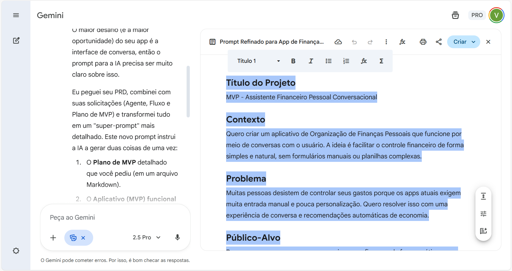
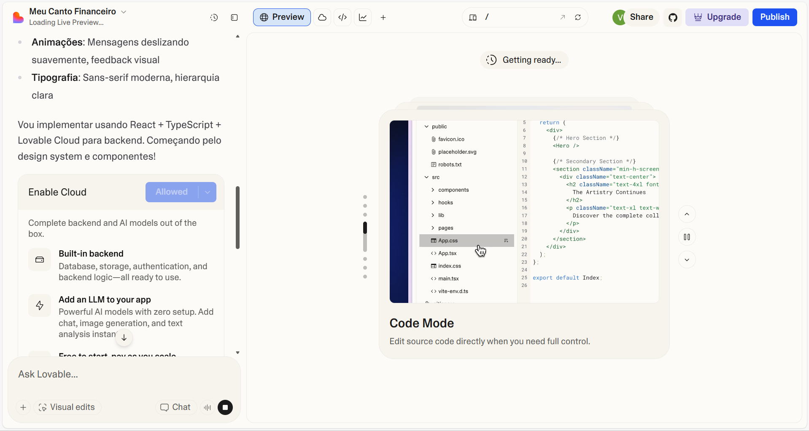
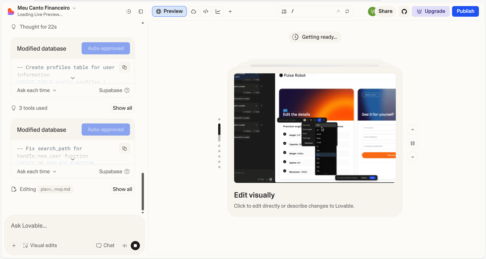
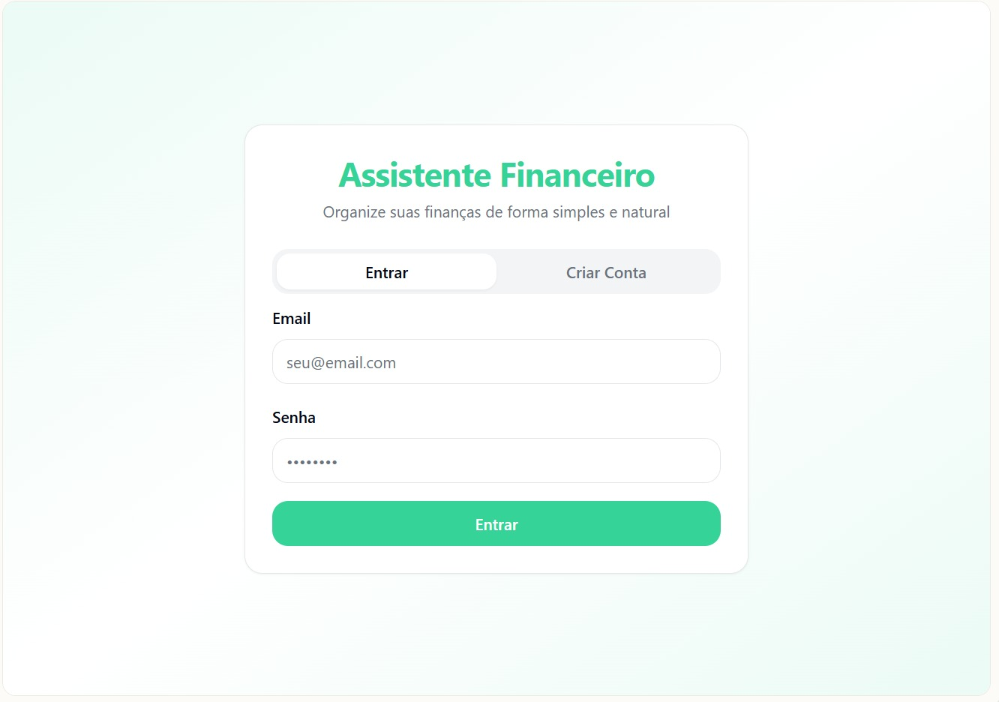
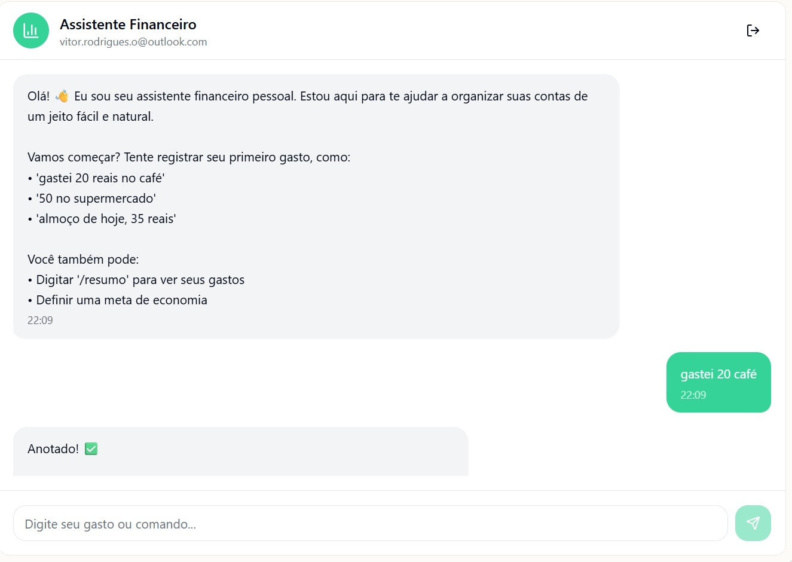
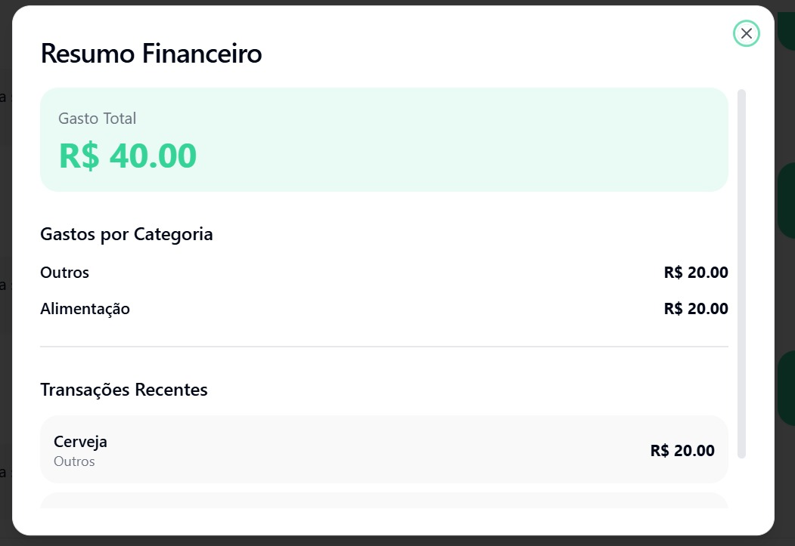

# 💸 App de Organização de Finanças Pessoais com Vibe Coding

## Prompt inicial utilizado para a criação do PRD

```txt
Quero criar um MVP de um APP de finanças no Lovable. Preciso da sua ajuda para refinar meu PRD (prompt) para que eu consiga fazer isso da forma mais eficiente possível.

O modelo inicial que eu tenho é o seguinte:
´´´´
# Contexto
Quero criar um aplicativo de Organização de Finanças Pessoais que funcione por meio de conversas com o usuário.  
A ideia é facilitar o controle financeiro de forma simples e natural, sem formulários manuais ou planilhas complexas.

# Problema
Muitas pessoas desistem de controlar seus gastos porque os apps atuais exigem muita entrada manual e pouca personalização.  
Quero resolver isso com uma experiência de conversa e recomendações automáticas de economia.

# Público-Alvo
Pessoas que querem começar a organizar suas finanças de forma prática e sem complicação, principalmente iniciantes.

# Funcionalidades-Chave
1. Registrar gastos via chat em linguagem natural.  
2. Classificar automaticamente as transações.  
3. Definir e acompanhar metas financeiras.  
4. Receber dicas de economia do “Agente Financeiro”.  
5. Visualizar relatórios simples e personalizados.

# Entregável da IA
Gerar um plano de MVP com as principais telas, recursos necessários e um esboço de validação inicial.  
Usar tom educativo e linguagem acessível, em português.
´´´´

Preciso que o Lovable me entrege, principalmente, estes pontos abaixo.
´´´´
1. Agente Financeiro: defina o comportamento e o tom de voz de um consultor financeiro pessoal, alinhado ao público e objetivo do app.
2. Fluxo de Telas: peça à IA para gerar o fluxo conceitual de telas com base nas funcionalidades descritas no PRD, simulando a interação por conversa.
3. Plano de MVP: solicite um resumo das 5 funcionalidades principais, dos recursos necessários e um plano de validação inicial (como medir se o app cumpre seu propósito).
´´´´
```
### Imagem com interação com o Google Gemini



## Prompt enviado para o Lovable

```txt
Título do Projeto

MVP - Assistente Financeiro Pessoal Conversacional

Contexto

Quero criar um aplicativo de Organização de Finanças Pessoais que funcione por meio de conversas com o usuário. A ideia é facilitar o controle financeiro de forma simples e natural, sem formulários manuais ou planilhas complexas.

Problema

Muitas pessoas desistem de controlar seus gastos porque os apps atuais exigem muita entrada manual e pouca personalização. Quero resolver isso com uma experiência de conversa e recomendações automáticas de economia.

Público-Alvo

Pessoas que querem começar a organizar suas finanças de forma prática e sem complicação, principalmente iniciantes em controle financeiro.

Funcionalidades-Chave do MVP

Registro de Gastos via Chat: Usuário digita em linguagem natural (ex: "gastei R$ 50 na padaria" ou "almoço de hoje, 30 reais").

Classificação Automática (Simples): O app deve tentar categorizar o gasto (ex: "padaria" -> "Alimentação"). Para o MVP, pode usar palavras-chave simples.

Definição e Acompanhamento de Metas: Usuário define uma meta via chat (ex: "quero economizar R$ 300 este mês"). O app mostra o progresso.

Agente Financeiro (Bot): O chat é conduzido por um agente (bot) que responde, confirma registros e dá dicas simples.

Relatórios Simples: Um comando de chat (ex: "/resumo") que exibe um modal com os gastos totais e gastos por categoria (simples).

Entregáveis da IA (O que você deve gerar)

Gere DOIS arquivos:

1. O Aplicativo Web Funcional (MVP)

Arquivo: index.html
Tecnologia: Um único arquivo HTML.

Use Tailwind CSS para um design limpo, moderno e responsivo.

Use JavaScript (dentro do <script>) para toda a lógica.

Use Firebase Firestore para armazenar dados. Não use localStorage.

Obrigatório: Use as variáveis globais __app_id, __firebase_config e __initial_auth_token para configurar o Firebase e autenticar o usuário (use signInWithCustomToken ou signInAnonymously).

Obrigatório: Armazene os dados no Firestore em coleções como artifacts/{appId}/users/{userId}/transactions e artifacts/{appId}/users/{userId}/goals.

Interface e Lógica do App:

Componente Principal: Uma interface de chat (como um WhatsApp ou Messenger).

Fluxo do Chat:

O usuário digita na caixa de texto e pressiona "Enviar".

A mensagem do usuário aparece na tela.

O "Agente Financeiro" (Bot) deve responder em seguida.

Lógica de Registro (JavaScript):

Crie uma função para processar a entrada do usuário.

Tente extrair um valor (R$) e uma descrição (ex: "padaria").

Salve o objeto { description, amount, category, date } no Firestore.

O Agente (Bot) deve responder no chat: "Ok, registrei R$ 50 em Alimentação."

Lógica de Metas (JavaScript):

Se o usuário digitar "definir meta" ou similar, o Agente pergunta o valor.

Salve a meta no Firestore.

Lógica de Resumo (JavaScript):

Se o usuário digitar "/resumo" ou "ver resumo", o app deve:

Buscar os dados do Firestore.

Exibir um Modal (pop-up) sobre o chat, mostrando:

Gasto Total no Mês.

Lista simples de gastos por categoria (ex: "Alimentação: R$ 150", "Transporte: R$ 80").

Progresso da Meta (ex: "Meta: R$ 300 / Economizado: R$ 120").

2. O Plano de MVP Detalhado

Arquivo: plano_mvp.md
Formato: Markdown
Tom: Educativo e acessível, em português.

Este arquivo deve conter:

1. Definição do Agente Financeiro

Persona e Tom de Voz: Descreva em detalhes o comportamento e o tom de voz do consultor financeiro pessoal. (Ex: É um "guia" paciente, encorajador e calmo. Nunca julga o usuário. Usa linguagem simples, evita jargões financeiros, faz analogias fáceis, como "economizar é como encher um pote, cada gasto é um furinho").

Exemplos de Interação (Diálogos):

Onboarding (1ª vez): "Olá! Eu sou seu assistente financeiro. Estou aqui para te ajudar a organizar suas contas de um jeito fácil. Vamos começar? Tente registrar seu primeiro gasto, como 'gastei 20 reais no café'."

Registro de Gasto: (Usuário: "50 reais no supermercado") -> "Anotado! R$ 50 em Compras. Continue assim!"

Dica Proativa (Simples): "Notei que você já registrou 3 gastos com 'Ifood' esta semana. Que tal definir uma meta semanal para delivery?"

Consulta de Resumo: (Usuário: "/resumo") -> "Claro! Aqui está seu resumo do mês..."

2. Fluxo Conceitual de Telas (Conversacional)

Descreva a jornada do usuário em formato de fluxo, focado na conversa:

Onboarding: Usuário abre o app. Agente se apresenta e dá a primeira instrução (registrar um gasto).

Registro: Usuário digita um gasto. Agente confirma, classifica e salva no Firestore. A conversa continua.

Consulta: Usuário pede um resumo. O chat é sobreposto por um Modal com o relatório. Usuário fecha o modal e volta para o chat.

Definição de Meta: Usuário diz "quero economizar". Agente faz perguntas (Qual valor? Para quê?). Agente confirma a meta.

Acompanhamento: Periodicamente (ex: 1 vez por semana, simulado no chat), o Agente envia uma mensagem proativa: "Oi! Só passando para lembrar que você já atingiu 40% da sua meta de economia!"

3. Detalhamento do Plano de MVP

Resumo das 5 Funcionalidades-Chave:

(Descreva brevemente como cada uma das 5 funcionalidades listadas acima será implementada neste MVP).

Recursos Necessários (Para este MVP):

Frontend: HTML, Tailwind CSS, JavaScript (Vanilla JS).

Backend/DB: Firebase (Autenticação Anônima/Custom e Firestore).

Lógica Principal: Uma função JS de "processamento de linguagem" (parser) muito simples, baseada em palavras-chave e expressões regulares (regex) para identificar valores (R$) e categorias.

Plano de Validação Inicial (Como medir o sucesso):

Métricas Quantitativas (O que medir):

Taxa de Ativação: % de usuários que registram o primeiro gasto.

Retenção (D1/D7): % de usuários que voltam no dia seguinte / 7 dias depois.

Engajamento: Média de gastos registrados por usuário/semana.

Adoção de Features: % de usuários que definiram pelo menos uma meta.

Feedback Qualitativo (Como perguntar):

Após 3 dias de uso, disparar uma pergunta no chat: "Em uma escala de 0 a 10, quão fácil foi registrar seus gastos?".

Entrevistar 5 usuários para entender: "Houve algum gasto que você tentou registrar e eu não entendi?".
```
### Imagens da interação com o Lovable e resultados obtidos










