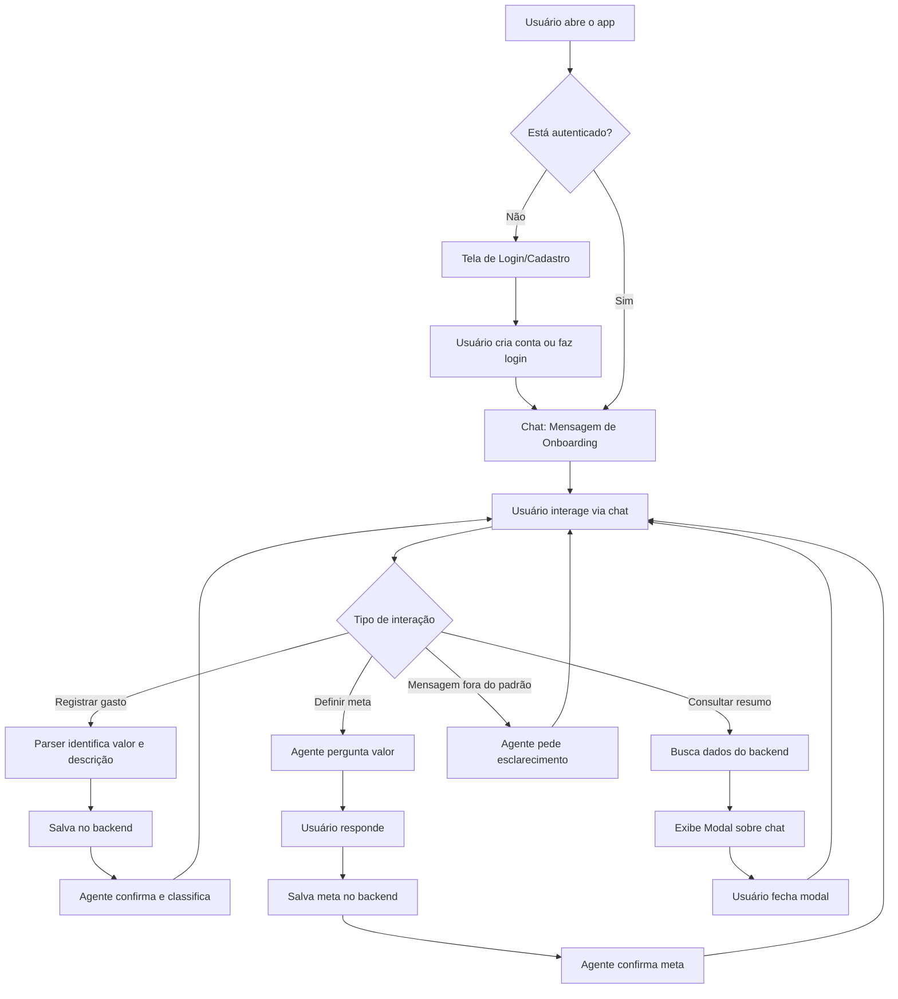

# Plano de MVP - Assistente Financeiro Pessoal Conversacional

## 1. Definição do Agente Financeiro

### Persona e Tom de Voz

O **Assistente Financeiro** é um guia paciente, encorajador e calmo que está ao lado do usuário em sua jornada de organização financeira. Ele nunca julga o usuário por seus gastos - ao invés disso, celebra cada pequeno progresso e oferece suporte constante.

**Características principais:**
- **Linguagem simples e acessível**: Evita jargões financeiros complexos. Prefere termos do dia a dia.
- **Analogias fáceis**: Usa comparações do cotidiano para explicar conceitos (ex: "economizar é como encher um pote, cada gasto é um furinho")
- **Encorajador**: Celebra conquistas, por menores que sejam ("Parabéns! Você já registrou 5 gastos essa semana!")
- **Proativo mas não invasivo**: Oferece dicas no momento certo, mas não sobrecarrega com informações
- **Empático**: Reconhece que controlar finanças pode ser desafiador

### Exemplos de Interação

#### 1. Onboarding (Primeira Vez)
**Contexto**: Usuário abre o app pela primeira vez após criar conta.

```
🤖 Agente: "Olá! 👋 Eu sou seu assistente financeiro pessoal. Estou aqui para 
te ajudar a organizar suas contas de um jeito fácil e natural.

Vamos começar? Tente registrar seu primeiro gasto, como:
• 'gastei 20 reais no café'
• '50 no supermercado'
• 'almoço de hoje, 35 reais'

Você também pode:
• Digitar '/resumo' para ver seus gastos
• Definir uma meta de economia"
```

#### 2. Registro de Gasto Bem-Sucedido
```
👤 Usuário: "50 reais no supermercado"

🤖 Agente: "Anotado! ✅

R$ 50,00 em Compras
'Supermercado'

Continue registrando seus gastos! Digite '/resumo' quando quiser ver o total."
```

#### 3. Primeiro Gasto Confuso
```
👤 Usuário: "comprei umas coisas"

🤖 Agente: "Hmm, não consegui identificar o valor do gasto. 🤔

Tente algo como:
• 'gastei 20 reais no café'
• '50 no supermercado'
• 'R$ 35,50 de almoço'"
```

#### 4. Dica Proativa (Após Padrão Identificado)
```
🤖 Agente: "💡 Notei que você já registrou 3 gastos em Alimentação esta 
semana. Que tal definir uma meta para essa categoria?"
```

#### 5. Definição de Meta
```
👤 Usuário: "quero economizar"

🤖 Agente: "Legal! Quanto você quer economizar? Por exemplo: 'R$ 500' ou 
'500 reais'"

👤 Usuário: "300 reais"

🤖 Agente: "Perfeito! Meta de R$ 300,00 definida com sucesso! 🎯

Vou te ajudar a acompanhar seu progresso. Você pode verificar a qualquer 
momento digitando '/resumo'."
```

#### 6. Consulta de Resumo
```
👤 Usuário: "/resumo"

🤖 Agente: "Claro! Veja seu resumo financeiro no modal que acabei de abrir. 📊"

[Modal aparece com informações detalhadas]
```

#### 7. Acompanhamento Periódico (Simulado)
```
🤖 Agente: "Oi! Só passando para lembrar que você já atingiu 40% da sua 
meta de economia! Continue assim! 🌟"
```

## 2. Fluxo Conceitual de Telas (Conversacional)

### Jornada do Usuário



### Detalhamento dos Fluxos

#### Fluxo 1: Onboarding
1. Usuário abre o app pela primeira vez
2. Tela de autenticação aparece
3. Usuário cria conta (email + senha)
4. Sistema cria perfil automaticamente
5. Chat inicia com mensagem de boas-vindas do Agente
6. Agente explica como usar e dá exemplos
7. Aguarda primeira interação do usuário

#### Fluxo 2: Registro de Gasto
1. Usuário digita um gasto (ex: "30 reais no uber")
2. Mensagem aparece no chat como "usuário"
3. Sistema processa com parser de linguagem natural
4. Parser extrai: valor (30), descrição (uber), categoria (Transporte)
5. Sistema salva no backend (Lovable Cloud/Supabase)
6. Agente responde confirmando: "Anotado! R$ 30,00 em Transporte"
7. Conversa continua

**Caso de erro**: Se parser não entender, Agente pede clarificação

#### Fluxo 3: Definição de Meta
1. Usuário menciona "meta" ou "economizar" no chat
2. Sistema detecta intenção
3. Agente pergunta: "Quanto você quer economizar?"
4. Usuário responde com valor
5. Sistema extrai valor e salva meta no backend
6. Agente confirma e explica como acompanhar

#### Fluxo 4: Consulta de Resumo
1. Usuário digita "/resumo" (ou equivalente)
2. Sistema busca todas as transações e metas do backend
3. Calcula totais e agrupa por categoria
4. Modal aparece sobre o chat com visualização completa
5. Modal mostra:
   - Gasto total do período
   - Breakdown por categoria
   - Progresso de metas (com barra de progresso)
   - Lista de transações recentes
6. Usuário fecha modal
7. Retorna ao chat

#### Fluxo 5: Acompanhamento Proativo
1. Sistema detecta padrões (ex: 3 gastos na mesma categoria)
2. Em momento oportuno, Agente envia mensagem espontânea
3. Oferece dica ou pergunta relevante
4. Usuário pode ignorar ou engajar

## 3. Detalhamento do Plano de MVP

### Resumo das 5 Funcionalidades-Chave

#### 1. Registro de Gastos via Chat
**Como funciona:**
- Usuário escreve em linguagem natural (ex: "20 reais no café")
- Parser simples (regex + palavras-chave) extrai:
  - Valor monetário (usando padrões como "R$", "reais")
  - Descrição (texto restante após limpar o valor)
  - Categoria (usando dicionário de palavras-chave)
- Sistema salva no Lovable Cloud (tabela `transactions`)
- Agente confirma via mensagem no chat

**Implementação:**
- Parser em JavaScript/TypeScript
- Padrões regex para valores: `/r\$\s*(\d+(?:[.,]\d{1,2})?)/i`
- Dicionário de categorias com palavras-chave
- Validação de entrada antes de salvar

#### 2. Classificação Automática (Simples)
**Como funciona:**
- Usa palavras-chave para identificar categorias
- Categorias pré-definidas:
  - Alimentação: padaria, supermercado, restaurante, ifood
  - Transporte: uber, ônibus, gasolina
  - Lazer: cinema, bar, show
  - Saúde: farmácia, médico
  - Casa: aluguel, água, luz
  - Compras: loja, roupa, shopping
  - Outros: fallback

**Implementação:**
- Objeto JavaScript com mapeamento categoria -> palavras-chave
- Função que verifica inclusão de keywords na descrição
- Categoria padrão "Outros" se nada combinar

#### 3. Definição e Acompanhamento de Metas
**Como funciona:**
- Usuário menciona "meta" ou "economizar"
- Agente pergunta valor desejado
- Sistema cria meta no backend (tabela `goals`)
- Meta inclui: título, valor alvo, valor atual, deadline (opcional)
- Usuário pode consultar progresso via `/resumo`

**Implementação:**
- Detecção de intenção por palavras-chave
- Estado conversacional (aguardando resposta de valor)
- Extração de valor numérico da resposta
- Cálculo de progresso: (valor_atual / valor_alvo) * 100

#### 4. Agente Financeiro (Bot)
**Como funciona:**
- Responde a todas as mensagens do usuário
- Comportamento baseado em regras:
  - Se detecta valor + descrição → registra gasto
  - Se detecta "/resumo" → mostra relatórios
  - Se detecta "meta" → inicia fluxo de meta
  - Caso contrário → pede esclarecimento
- Tom sempre encorajador e claro

**Implementação:**
- Sistema de mensagens com roles (user/bot)
- Função de processamento que analisa entrada do usuário
- Respostas pré-escritas para cada tipo de interação
- Sistema de estados para fluxos multi-turno (ex: definir meta)

#### 5. Relatórios Simples
**Como funciona:**
- Comando `/resumo` abre modal sobre o chat
- Modal exibe:
  - Card com gasto total do mês
  - Lista de gastos agrupados por categoria
  - Barras de progresso para metas
  - Lista de transações recentes
- Dados buscados do backend em tempo real

**Implementação:**
- Modal component (React Dialog)
- Agregação de dados no frontend
- Visualização com componentes UI (Progress, Cards)
- ScrollArea para grandes listas

### Recursos Necessários

#### Frontend
- **React** com TypeScript
- **Tailwind CSS** para estilos
- **Componentes:**
  - Chat principal (lista de mensagens)
  - Input de mensagem
  - ChatMessage component (bubble)
  - SummaryModal component
  - Auth pages (login/signup)
- **Hooks:**
  - useState para estado local
  - useEffect para auth e dados
  - useRef para scroll automático

#### Backend / Database
- **Lovable Cloud** (Supabase)
- **Autenticação:** Email + senha (auto-confirm ativo)
- **Tabelas:**
  - `profiles`: dados do usuário
  - `transactions`: gastos registrados
  - `goals`: metas de economia
- **RLS Policies:** Usuários só acessam seus próprios dados

#### Lógica Principal
- **Parser de Linguagem Natural:**
  - Baseado em regex para extrair valores
  - Dicionário de palavras-chave para categorias
  - Funções: `parseTransaction()`, `extractGoalAmount()`
- **Sistema de Chat:**
  - Array de mensagens (user + bot)
  - Processamento sequencial de entrada
  - Respostas condicionais baseadas em regex/keywords

### Design System
- **Cores principais:**
  - Verde esmeralda (#10b981) para sucesso/finanças
  - Cinza claro para mensagens do bot
  - Branco/Preto para texto
- **Componentes:**
  - Bubbles de chat arredondadas
  - Modal limpo e organizado
  - Animações suaves (fade-in, slide-in)
- **Responsividade:** Mobile-first

## 4. Plano de Validação Inicial

### Métricas Quantitativas (O que medir)

#### 1. Taxa de Ativação
**Definição:** % de usuários que registram o primeiro gasto

**Como medir:**
```sql
SELECT 
  COUNT(DISTINCT user_id) as usuarios_com_gastos,
  (SELECT COUNT(*) FROM profiles) as total_usuarios,
  (COUNT(DISTINCT user_id)::float / (SELECT COUNT(*) FROM profiles)) * 100 as taxa_ativacao
FROM transactions;
```

**Meta MVP:** ≥ 60% (6 em cada 10 usuários registram pelo menos 1 gasto)

#### 2. Retenção (D1/D7)
**Definição:** 
- D1: % de usuários que voltam no dia seguinte
- D7: % de usuários que voltam após 7 dias

**Como medir:**
- Registrar última data de login
- Comparar com data de criação da conta
- Calcular % que retorna em cada período

**Meta MVP:** 
- D1 ≥ 40%
- D7 ≥ 20%

#### 3. Engajamento
**Definição:** Média de gastos registrados por usuário ativo por semana

**Como medir:**
```sql
SELECT 
  AVG(gastos_por_usuario) as media_gastos_semanais
FROM (
  SELECT 
    user_id,
    COUNT(*) as gastos_por_usuario
  FROM transactions
  WHERE created_at >= NOW() - INTERVAL '7 days'
  GROUP BY user_id
) subquery;
```

**Meta MVP:** ≥ 3 gastos/usuário/semana

#### 4. Adoção de Features
**Definição:** % de usuários que definiram pelo menos uma meta

**Como medir:**
```sql
SELECT 
  COUNT(DISTINCT user_id)::float / (SELECT COUNT(*) FROM profiles) * 100 
  as taxa_adocao_metas
FROM goals;
```

**Meta MVP:** ≥ 30% (3 em cada 10 usuários criam uma meta)

### Feedback Qualitativo (Como perguntar)

#### 1. Pesquisa In-App (Após 3 Dias de Uso)
**Momento:** Após usuário registrar 5+ gastos

**Pergunta no chat:**
```
🤖 Agente: "Em uma escala de 0 a 10, quão fácil foi registrar seus gastos?"

[Usuário responde com número]

🤖 Agente: "Obrigado! Pode me contar o que mais gostou ou o que poderia 
melhorar?"

[Salvar resposta no backend para análise]
```

#### 2. Entrevistas com Usuários (Qualitativo Profundo)
**Objetivo:** Entender comportamento e dores

**Roteiro:**
1. "Como você está usando o app no dia a dia?"
2. "Houve algum gasto que você tentou registrar e eu não entendi?"
3. "O que te fez definir (ou não definir) uma meta?"
4. "Como você imagina que o app poderia te ajudar mais?"
5. "Você recomendaria para um amigo? Por quê?"

**Meta:** Entrevistar 5-10 usuários na primeira semana

#### 3. Análise de Padrões de Uso
**Observar:**
- Quais categorias são mais usadas
- Quais tipos de descrição o parser não entende (logs de erro)
- Quantas vezes usuários digitam "/resumo"
- Tempo médio entre registros de gasto

### Critérios de Sucesso do MVP

**O MVP será considerado validado se:**

1. ✅ Taxa de Ativação ≥ 60%
2. ✅ Retenção D1 ≥ 40%
3. ✅ Engajamento ≥ 3 gastos/semana
4. ✅ NPS (Net Promoter Score) ≥ 30
5. ✅ Menos de 20% de gastos não entendidos pelo parser

**Próximos Passos Após Validação:**
- Melhorar parser com ML para entender linguagem mais complexa
- Adicionar categorias customizadas
- Insights automáticos (ex: "Você gastou 30% a mais este mês")
- Notificações proativas
- Exportação de relatórios

---

## Conclusão

Este MVP foca em **simplicidade e conversação natural** para resolver o problema principal: **facilitar o registro de gastos sem fricção**. 

O agente financeiro é o coração do produto - ele guia, encoraja e torna a experiência de controlar finanças mais humana e menos robótica.

As métricas de validação nos dirão se estamos no caminho certo para criar um produto que as pessoas realmente usam e recomendam.
